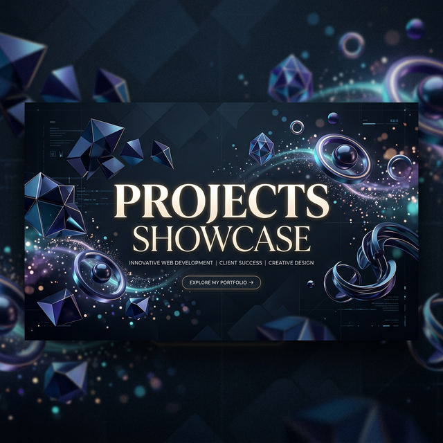

# 🚀 Projects Showcase Portfolio



## ✨ Overview

Welcome to my premium **3D Portfolio Showcase**! This project is a high-end, interactive web application designed to demonstrate my technical expertise, design sensibility, and the diverse range of digital products I've built.

Built with **React 19**, **Vite**, and **Three.js**, this portfolio features smooth animations, immersive 3D environments, and a sleek, modern UI/UX.

---

## 🛠️ Tech Stack

- **Core:** React 19, JavaScript (ES6+)
- **Build Tool:** Vite
- **3D Graphics:** Three.js, @react-three/fiber, @react-three/drei
- **Animations:** Framer Motion
- **Routing:** React Router DOM v7
- **Styling:** Vanilla CSS (Custom properties, Flexbox, Grid)
- **Deployment:** Vercel

---

## 🌟 Featured Projects

This showcase includes several high-impact projects:

1.  **[GIT Code Reviewer](https://github.com/anubhabguha1999/git-code-reviewer)**: A Chrome extension for real-time GitHub code analysis using Babel AST.
2.  **[Automated AI PR Reviewer](https://github.com/anubhabguha1999/pr-generator)**: A scalable backend service using GPT-4o and BullMQ for automated code reviews.
3.  **[Forge Developers](https://forge-developers.vercel.app/)**: A comprehensive DevTools SaaS platform featuring Postman-like API testing.
4.  **[YouTube Downloader Pro](https://youtube-downloader-pro-psi.vercel.app/)**: A high-performance media retrieval tool with 4K support and ffmpeg processing.

---

## 🚀 Getting Started

### Prerequisites

- [Node.js](https://nodejs.org/) (v18 or higher)
- [npm](https://www.npmjs.com/) or [yarn](https://yarnpkg.com/)

### Installation

1.  **Clone the repository:**

    ```bash
    git clone https://github.com/anubhabguha1999/projects.git
    cd projects
    ```

2.  **Install dependencies:**

    ```bash
    npm install
    ```

3.  **Run the development server:**

    ```bash
    npm run dev
    ```

4.  **Build for production:**
    ```bash
    npm run build
    ```

---

## 📁 Project Structure

```text
/
├── public/          # Static assets (images, icons, etc.)
├── src/
│   ├── assets/      # Project-specific screenshots
│   ├── components/  # Reusable UI components (Navbar, Footer, Scene3D)
│   ├── data/        # Centralized project configuration (projects.js)
│   ├── pages/       # Page components (Home, ViewProject)
│   ├── styles/      # Modular navigation and page styling
│   ├── App.jsx      # Main application router
│   └── main.jsx     # Entry point
├── package.json     # Project dependencies and scripts
└── vite.config.js   # Vite configuration
```

---

## 🤝 Contact

I'm always open to new collaborations and exciting ideas. Feel free to reach out!

- **GitHub:** [@anubhabguha1999](https://github.com/anubhabguha1999)
- **Portfolio:** [Your Portfolio Link Here]
- **Email:** your.email@example.com

---

Managed by **[Anubhab Guha](https://github.com/anubhabguha1999)**
